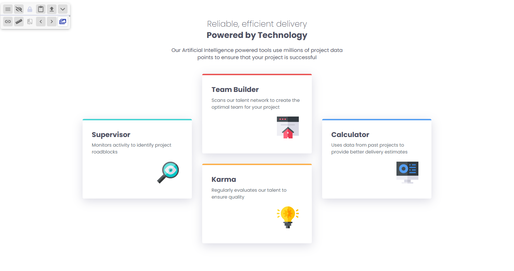

# Frontend Mentor - Four card feature section solution

This is a solution to the [Four card feature section challenge on Frontend Mentor](https://www.frontendmentor.io/challenges/four-card-feature-section-weK1eFYK). Frontend Mentor challenges help you improve your coding skills by building realistic projects. 

## Table of contents

- [Overview](#overview)
  - [The challenge](#the-challenge)
  - [Screenshot](#screenshot)
  - [Links](#links)
- [My process](#my-process)
  - [Built with](#built-with)
  - [What I learned](#what-i-learned)
- [Author](#author)

## Overview

### The challenge

Users should be able to:

- View the optimal layout for the site depending on their device's screen size

### Screenshot

### Links

- Solution URL: [https://github.com/ivan-develops/four-card-feature-section-master](https://github.com/ivan-develops/four-card-feature-section-master)
- Live Site URL: [https://ivan-develops.github.io/four-card-feature-section-master/](https://ivan-develops.github.io/four-card-feature-section-master/)

## My process

### Built with

- Semantic HTML5 markup
- CSS custom properties
- Mobile-first workflow
- CSS Grid
- CSS Flex-box

### What I learned

I learned to combine the use of `width`, `max-width` and `min-width`... it can be a useful way to define responsive behaviors, without adding code in `@media`.

## Author

- Website - [https://github.com/ivan-develops](https://github.com/ivan-develops)
- LinkedIn - [@ivanvargaso](https://www.linkedin.com/in/ivanvargaso/)
- Frontend Mentor - [@IvanInterfaceDeveloper](https://www.frontendmentor.io/profile/IvanInterfaceDeveloper)